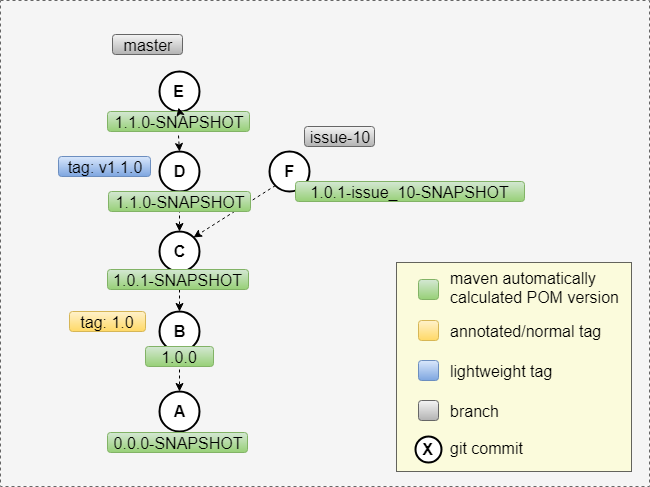
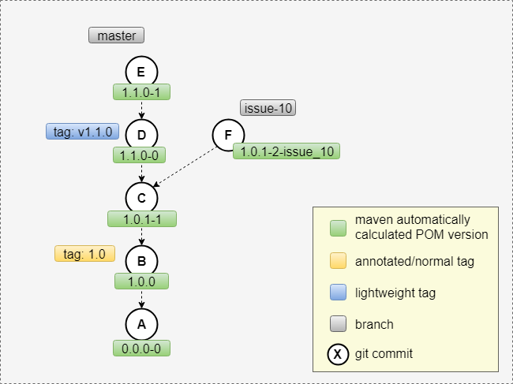

Introduction
========================

`jgitver`_ in essence is a set of tool providing auto-computation of projects versioning.

Main features include:
* project version calculation (`semver`_ compatible)
* standardized but configurable computations
* 0 file modification and thus 0 additional commit
* plugins for :ref:`maven-usage <maven>` and :ref:`gradle-usage <gradle>`

When activated, jgitver is able for example to compute version number *à la maven* as following:

    jgitver in 'maven' mode

    Using a maven like configuration, it is possible for your project to automatically:
        * use SNAPSHOTS
        * have dedicated versioning for branch
        * have released versions for release tags

but depending on your needs, you could also configure jgitver to produce:

    jgitver producing unique versions for each commit

    In this mode:
        * versions are suffixed with the distance to the base tag
        * have dedicated versioning for branch
        * have released versions for release tags

.. _semver: http://semver.org/
.. _jgitver: https://github.com/jgitver/jgitver